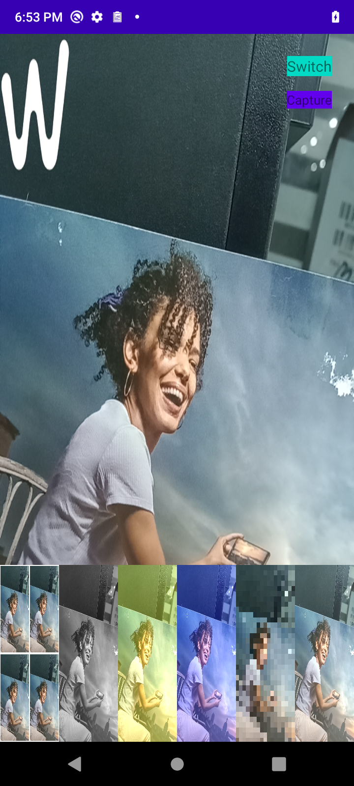

# 探索CameraX在应用端的使用

## Demo效果


## 起源
针对相机开发涉及专业知识多，且Camera2 api架构复杂等痛点，
在今年的Google I/O大会上，Google推出了一个新的Jetpack组件--CameraX，这个支持包的作用为:
> help you make camera app development easier

## 优势
1. 适用大部分android设备，且向后兼容至Android5.0(API level 21)
2. 基于Use Case设计，api使用简单，且代码量更少
3. 与Lifecycle组件结合，自动管理相机的生命周期
4. 与主流手机厂商合作，通过CameraX可以使用手机厂商系统相机app独有的人像，美颜，hdr等效果

## 基本使用
CameraX基于Use Case进行设计，使调用者专注于需要完成的任务，而无需花时间处理不同设备的细微差别,
目前包括三种基本用例:

1. Preview
2. Image Analysis
3. Capture

不管是预览还是图像分析，图片拍摄，CameraX用例的使用都遵循一个统一的基本流程：

1. 通过建造者模式构建Config类；
2. 通过Config类创建Case；
3. 绑定生命周期

CameraX目前处于alpha版本，在使用时需要先添加依赖：
> `def camera_x_version = "1.0.0-alpha06"`  
> `implementation "androidx.camera:camera-core:${camera_x_version}"`  
> `implementation "androidx.camera:camera-camera2:${camera_x_version}"`

### 预览

```

    // 1. create config
    val previewConfig = PreviewConfig.Builder()
                            .setLensFacing(CameraX.LensFacing.FRONT)
                            .build()
                            
    // 2. create case
    val preview = Preview(previewConfig)
    
    // 3. register first frame
    preview.setOnPreviewOutputUpdateListener {
        mTextureView.surfaceTexture = it.surfaceTexture
    }
    
    // 4. binding
    CameraX.bindToLifecycle(this, preview)


```
### 拍照

```

    // 1. create config
    val imageCaptureBuildConfig = ImageCaptureConfig.Builder()
            .setLensFacing(CameraX.LensFacing.FRONT)
            .setTargetRotation(windowManager.defaultDisplay.rotation)
            .setCaptureMode(ImageCapture.CaptureMode.MAX_QUALITY)
            .build()
        
    // 2. create case
    val capture = ImageCapture(imageCaptureBuildConfig);
        
    // 3. binding
    CameraX.bindToLifecycle(this, capture)
        
    // 4. take photo
    capture.takePicture(...)

```

###  图像分析
图像分析用例为开发者提供了可供CPU访问以执行图像处理，计算机视觉或者机器学习推断的图像。
该用例会对每帧执行注册的analyze方法。  
图像分析可以分为两种模式：阻塞模式和非阻塞模式。

阻塞模式通过 `ImageAnalysis.ImageReaderMode.ACQUIRE_NEXT_IMAGE` 设置，在此模式下，
分析器会按顺序从相机接收帧；这意味着，如果 analyze 方法花费的时间超过单帧在当前帧速率下的延迟时间，
则帧可能不再是最新的帧，因为新帧已被阻止进入流水线，直到该方法返回为止；

非阻塞模式通过 `ImageAnalysis.ImageReaderMode.ACQUIRE_LATEST_IMAGE` 设置。
在此模式下，分析器会从相机接收调用 analyze 方法时的最后一个可用帧。
如果此方法花费的时间超过单帧在当前帧速率下的延迟时间，可能会跳过某些帧，
以便在下一次 analyze 接收数据时，它会获取相机流水线中的最后一个可用帧。

···

    // 1. create config
    val imageAnalysisConfig = ImageAnalysisConfig.Builder()
        .setLensFacing(CameraX.LensFacing.FRONT)
        .setTargetResolution(Size(1280, 720))
        .setImageReaderMode(ImageAnalysis.ImageReaderMode.ACQUIRE_LATEST_IMAGE)
        .build()
        
    // 2. create case
    val imageAnalysis = ImageAnalysis(imageAnalysisConfig)

    // 3. register analyzer
    imageAnalysis.setAnalyzer(mExecutor， { image: ImageProxy, rotationDegrees: Int ->
        // image format -> YUV_420_888
    })

    CameraX.bindToLifecycle(this, imageAnalysis)

···

## 供应商扩展
手机厂商的系统相机app有很多优秀的相机效果，比如bokeh，hdr，beauty等，
第三方相机app可以通过CameraX Extensions使用到这些效果，如果厂商支持，否则采用CameraX的默认实现

```

    // Create a Builder same as in normal workflow.
    val builder = ImageCaptureConfig.Builder()
     
    // Create a Extender object which can be used to apply extension
    // configurations.
    val bokehImageCapture = BokehImageCaptureExtender.create(builder)

    // Query if extension is available (optional).
    if (bokehImageCapture.isExtensionAvailable()) {
        // Enable the extension if available.
        bokehImageCapture.enableExtension()
    }

    // Finish constructing configuration with the same flow as when not using
    // extensions.
    val config = builder.build()
    val useCase = ImageCapture(config)
    CameraX.bindToLifecycle(this as LifecycleOwner, useCase)

```

## CameraX + OpenGl
在预览用例中，通过注册setOnPreviewOutputUpdateListener，可以拿到一个相机图像流的SurfaceTexture,
通过SurfaceTexture的`attachToGLContext`方法将一个OES纹理关联到GL环境中。

> * Attach the SurfaceTexture to the OpenGL ES context that is current on the calling thread.  A
      This new texture is bound to the GL_TEXTURE_EXTERNAL_OES texture target.

然后将OES纹理绘制到OpenGL对应的Surface上。

代码实现参考Render类和TextureDrawer类

## 几种滤镜实现和马赛克实现
1. 灰度滤镜:权值法, 人眼对红绿蓝色敏感程度不一样, 绿色 > 红色 > 蓝色

```

    vec4 mask = texture2D(uTextureSampler, vTextureCoord);  
    float fGrayColor = (0.3 * mask.r + 0.59 * mask.g + 0.11 * mask.b);  
    gl_FragColor = vec4(fGrayColor, fGrayColor, fGrayColor, 1.0);

```

2. 暖色滤镜:暖色增强, 红色和绿色为暖色, 适当增强

```

    vec4 mask = texture2D(uTextureSampler, vTextureCoord);
    gl_FragColor = mask + vec4(0.3, 0.3, 0.0, 0.0);

```

3. 冷色滤镜:冷色增强, 蓝色为冷色, 适当增强

```

    vec4 mask = texture2D(uTextureSampler, vTextureCoord);
    gl_FragColor = mask + vec4(0.0, 0.0, 0.3, 0.0);

```

4. 马赛克:把图片的一个相当大小区域用同一个点的颜色来表示,通过降低图像的分辨率,从而使图像一些细节隐藏起来

```

    vec2 pixelXY = vec2(vTextureCoord.x * previewSize.x, vTextureCoord.y * previewSize.y);
    vec2 mosaicXY = vec2(floor(pixelXY.x / mosaicSize.x) * mosaicSize.x, floor(pixelXY.y / mosaicSize.y) * mosaicSize.y);
    vec2 newPixelStCoord = vec2(mosaicXY.x / previewSize.x, mosaicXY.y / previewSize.y);
    gl_FragColor = texture2D(uTextureSampler, newPixelStCoord);

```


